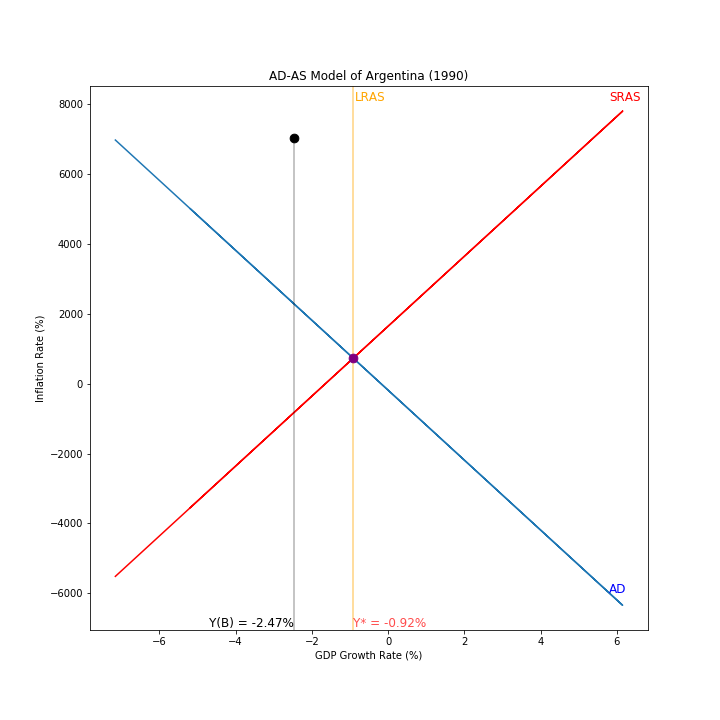
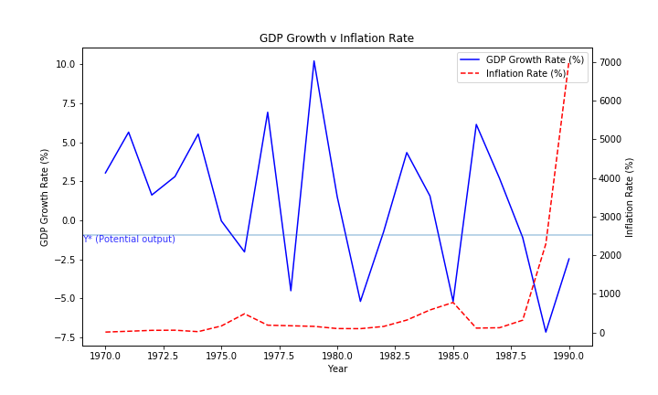

# macro-country-analysis
Macroeconomic Analysis of Argentina

This project analyzes and addresses the macroeconomic situation of Argentina in the year 1990 using an aggregate supply and aggregate demand (AD-AS) model. The AD-AS model is used to gauge whether the economy is performing at its potential, in addition to identifying causes of and remedies to the contemporary  state of the economy. 

The results found that a combination of diminished aggregate supply and unrestricted aggregate demand caused a decline in output but a substantial rise in inflation. The analysis concludes with a policy recommendation of improved and consistent contractionary fiscal policies.

The full report can be found in `report-analysis/report.docx`

-----

Data was sourced from the [World Bank](https://data.worldbank.org/country/argentina) on 07/08/2023

Argentina inflation data sourced from: https://www.bcra.gob.ar/PublicacionesEstadisticas/Principales_variables_datos_i.asp

